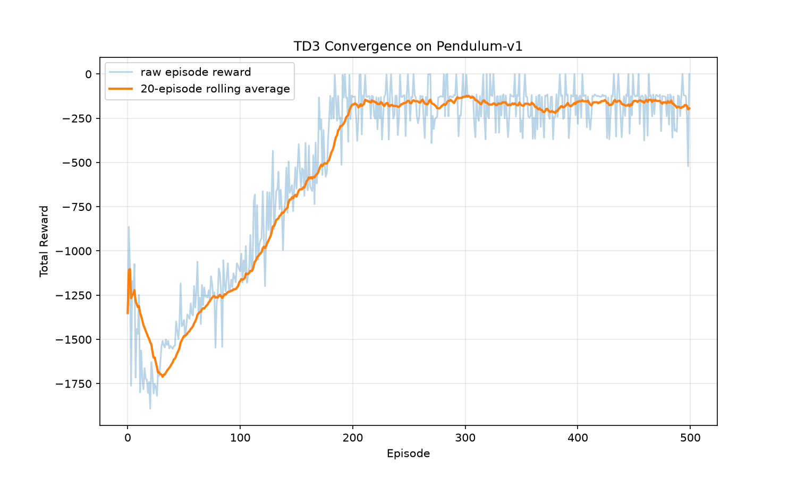
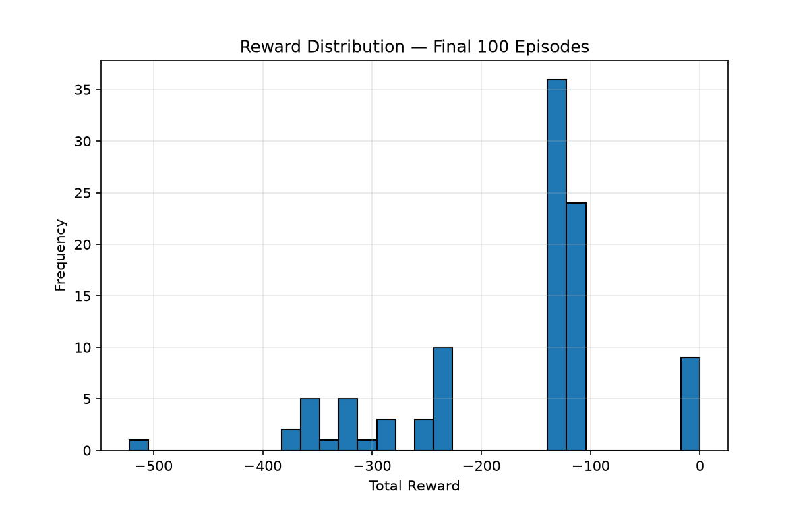

# TD3 Agent Validation with Pendulum-v1

## Purpose
This is a minimal, disposable sister repo to [mujoco-gripper-rl](https://github.com/chrisfox9158/mujoco-gripper-rl). The repo is designed to validate the existing TD3 implementation independent of the MuJoCo environment's difficulty, parameters, and reward design.

The MuJoCo project's custom `agent/` code, which implements `Actor`/`Critic` networks, a pre-allocated NumPy `ReplayBuffer`, and the full `TD3` class architecture (twin critics, delayed policy updates, target policy smoothing, soft target updates) is copied here. The architecture is unmodified beyond the removal of the `save()`/`load()` methods and the `loader/` folder convention, replaced by the training loop's matplotlib-based logger.

In this repo, the TD3 implementation is trained against [Gymnasium](https://gymnasium.farama.org/)'s `Pendulum-v1` environment. `Pendulum-v1` is a continuous-action benchmark task with a well-documented convergence signature. The environment provides a fast, low-compute method for confirming the TD3 agent codebase.

In order to isolate the TD3 architecture, this repo has no independent reward systems, environment design, or MuJoCo dependency. This complexity is replaced by the documented Gymnasium environment, such that any remaining bugs can be attributed to the agent code itself.

## Result
The TD3 implementation converges as expected. Per-episode reward climbs from random-policy baseline, around **-1200 to -1800** per episode, stabilizing at roughly **-100 to -250** by approximately **episode 200**. The remainder of the run (500 total documented episodes) continues this pattern.




This range and shape match published TD3 benchmarks for `Pendulum-v1`.

**Conclusion:** the six-network TD3 architecture, replay buffer, and update logic are functioning correctly. Any training difficulty observed in the MuJoCo project is attributable to that environment's task complexity, reward shaping, and available training budget.

## References
Agentic structure implements TD3 strategy, matching the twin-critic and delayed-update structure from Fujimoto et al. [arXiv:1802.09477](https://arxiv.org/abs/1802.09477)

The implemented Gymnasium Pendulum-v1 environment is maintained and documented at [gymnasium.farama.org](https://gymnasium.farama.org/environments/classic_control/pendulum/).

The reward convergence range of **-100 to -250** is consistent with the [Stable-Baselines3 RL Zoo](https://github.com/DLR-RM/rl-baselines3-zoo/blob/master/benchmark.md) benchmarks for the Pendulum-v1 environment, documented at **-151.855 ± 90.227** over 20,000 timesteps. Additional documentation can be found at [Hugging Face Stable-Baselines3 TD3 Pendulum-v1](https://huggingface.co/sb3/td3-Pendulum-v1).

## Setup
```bash
uv venv
uv sync
```

## Usage
Run the validation training loop:

```bash
uv run python train.py
```

Produces `runs/<timestamp>/summary.json`, `convergence.png`, and `final_distribution.png`.

## Repository Structure

```
agent/              # Copied directly from mujoco-gripper-rl (networks, replay buffer, TD3 orchestration)
config.py           # AGENT_SPECS / TRAINING_SPECS for run tuning
train.py            # Pendulum-v1 training loop + run logging
runs/               # Output of each training run (JSON + plots)
```